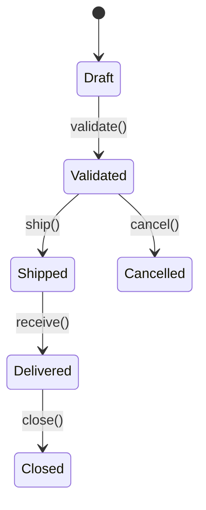

# Convention: Markdown Conventions for BA Deliverables

## Objective

This convention defines the Markdown writing conventions that **all BA agents** must follow. These conventions ensure that deliverables are:
- Usable by AI agents (parseable, structured)
- Convertible to Word via Pandoc (for human reviews)
- Syncable with Jira (for stories/epics)
- Versionable in Git (single source of truth)

---

## Rule 1: Mandatory YAML front matter

Each deliverable file MUST start with a YAML front matter block:

```yaml
---
id: <TYPE>-<NNN>
title: <Deliverable title>
phase: <1-scoping | 2-specification | 3-design>
type: <vision | glossaire | acteurs | domain-model | epic | feature | business-rule | user-story | user-flow | screen-spec | notification | test-scenario>
status: <draft | review | validated>
version: <X.Y>
last_updated: <YYYY-MM-DD>
author: <agent-id or human name>
reviewers: []
dependencies: []
---
```

### Field rules:
- `id`: unique identifier, prefixed by type (e.g.: `VIS-001`, `GLO-001`, `BR-042`, `US-103`)
- `status`: always `draft` on first production. Changes to `review` after generation, `validated` after human gate
- `version`: starts at `1.0`, increments the minor for corrections, the major for overhauls
- `dependencies`: list of `id` values of deliverables this document depends on

---

## Rule 2: Hierarchical heading structure

- `#` (H1): Main title of the deliverable (one per file)
- `##` (H2): Main sections
- `###` (H3): Sub-sections
- `####` (H4): Detailed elements

**Never skip a level** (no H1 to H3 directly).

---

## Rule 3: Unique identifiers on traceable elements

Any element that can be referenced by another deliverable MUST have a unique identifier in brackets:

```markdown
## [BR-012] International VAT Calculation
## [US-034] Place an order as a customer
## [ENT-005] Order
## [ACT-002] Stock Manager
```

### Identifier prefixes:
| Prefix | Type |
|--------|------|
| `VIS` | Vision / Scope |
| `GLO` | Glossary term |
| `ACT` | Actor |
| `ROL` | Role |
| `ENT` | Domain entity |
| `EP` | Epic |
| `FT` | Feature |
| `BR` | Business Rule |
| `US` | User Story |
| `UF` | User Flow |
| `SCR` | Screen specification |
| `NTF` | Notification |
| `TS` | Test scenario |

---

## Rule 4: Cross-references

To link to another element, use the following format:

```markdown
**Related business rules:** [BR-012], [BR-015]
**Related stories:** [US-034], [US-035]
**Concerned entities:** [ENT-005], [ENT-008]
```

Never reference an identifier that does not exist in another deliverable.

---

## Rule 5: Tables for structured data

Use Markdown tables systematically for:
- Entity attributes
- Rights matrices
- Value lists (enums)
- Comparisons

**Constraints:**
- Always include the separator line `|---|---|---|`
- Align pipes `|` for readability (optional but recommended)
- No merged cells (incompatible with AI parsing)

---

## Rule 6: Given/When/Then format for criteria and scenarios

```markdown
- **Given** <initial context>
- **When** <trigger action>
- **Then** <expected result>
- **And** <additional result> (optional, repeatable)
```

Always use **concrete values** (not "a valid amount" but "an amount of 150.00 EUR").

---

## Rule 7: State diagrams in Mermaid

For entity lifecycles, use Mermaid syntax:



---

## Rule 8: Language and style

- **Style:** Short sentences, active voice, no technical jargon (except in the glossary)
- **Precision:** Avoid "the system must be fast" — use "the response time must not exceed 2 seconds"
- **Business terms:** Always use glossary terms. If a term is not in the glossary, add it before using it

---

## Rule 9: File naming and location

Format: `{id}-{slug}.md` where `{id}` is the lowercase deliverable identifier and `{slug}` is a short kebab-case description.

Examples:
- `vis-001-product-vision.md` in `docs/1-prd/1-scoping/`
- `dom-001-domain-model.md` in `docs/1-prd/2-specification/`
- `ep-003-order-management.md` in `docs/1-prd/3-epics/ep-003-order-management/`
- `us-042-place-order-as-customer.md` in `.../ft-012-place-order/user-stories/`

**Scoping rule:** a document lives where its subject lives.
- Project-wide scope in `docs/1-prd/1-scoping/` or `docs/1-prd/2-specification/`
- Epic scope inside `docs/1-prd/3-epics/ep-xxx-{slug}/`
- Feature scope inside `docs/1-prd/3-epics/ep-xxx-{slug}/ft-xxx-{slug}/`

---

## Rule 10: Traceability metadata sections

Each deliverable MUST end with a traceability section:

```markdown
---

## Traceability

| Element | Detail |
|---------|--------|
| **Produced by** | <agent-id> |
| **Production date** | <YYYY-MM-DD> |
| **Inputs used** | <list of input deliverable ids> |
| **Validated by** | <name or "pending"> |
| **Validation date** | <YYYY-MM-DD or "pending"> |
```
