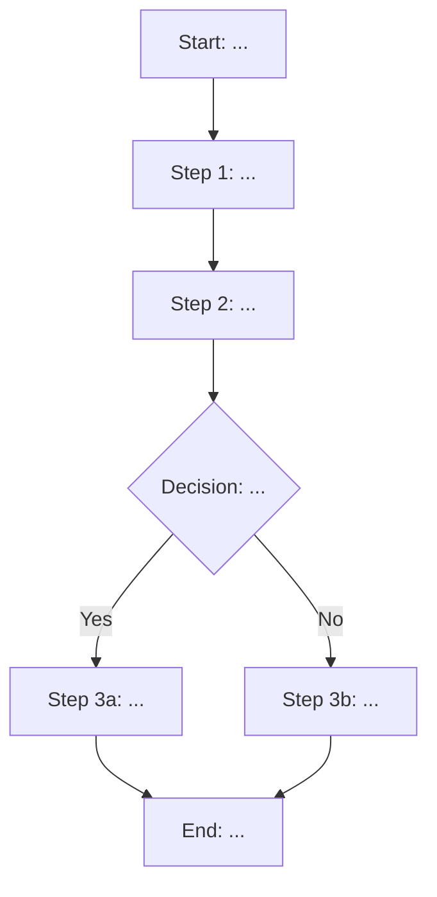

# [UF-001] User Journey Name

## Summary

| Property | Value |
|----------|-------|
| **Main actor** | [ACT-Hxxx] Name |
| **Objective** | <!-- What the user seeks to accomplish --> |
| **Entry point** | <!-- Where the user comes from --> |
| **Exit point** | <!-- Where the user ends up at the end --> |
| **Covered stories** | [US-001], [US-002], [US-003] |

---

## Nominal flow (Happy Path)

### Step 1: Step name

| Property | Value |
|----------|-------|
| **Screen** | [SCR-xxx] |
| **User action** | <!-- What the user does --> |
| **System response** | <!-- What the system does in return --> |
| **Displayed data** | <!-- What information is visible --> |
| **User inputs** | <!-- What data the user enters --> |

### Step 2: Step name

| Property | Value |
|----------|-------|
| **Screen** | [SCR-xxx] |
| **User action** | |
| **System response** | |
| **Displayed data** | |
| **User inputs** | |

<!-- Repeat for each step -->

---

## Alternative flows

### ALT-001: Alternative flow name

**Divergence point:** Step X of the nominal flow

**Condition:** <!-- When this alternative flow occurs -->

| Step | Action | Result |
|------|--------|--------|
| A1 | | |
| A2 | | |

**Convergence point:** Rejoins the nominal flow at step Y

---

## Error flows

### ERR-001: Error flow name

**Divergence point:** Step X of the nominal flow

**Error condition:** <!-- What triggers the error -->

| Step | System action | Business rule |
|------|--------------|---------------|
| E1 | Display error message: "..." | [BR-xxx] |
| E2 | <!-- Return to step / Block / Redirect --> | |

---

## Traceability

| Element | Detail |
|---------|--------|
| **Produced by** | agent-journeys |
| **Production date** | YYYY-MM-DD |
| **Inputs used** | [US-xxx], [DOM-001], [BRL-001] |
| **Validated by** | Pending |
| **Validation date** | Pending |
