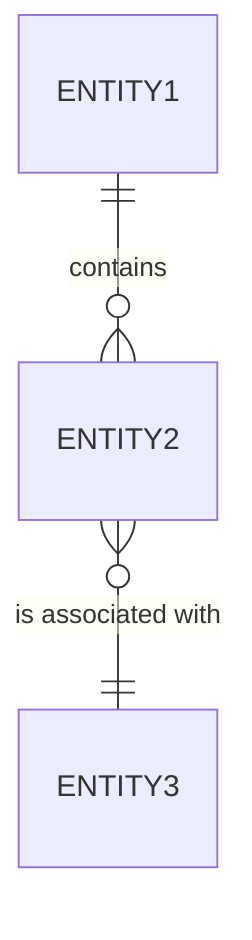
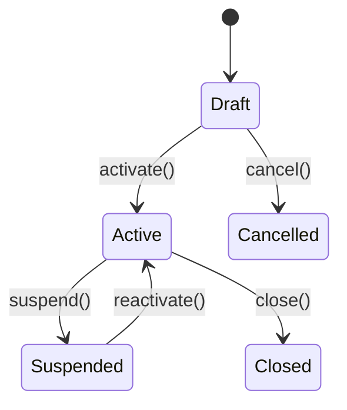

# [DOM-001] Functional Domain Model

## 1. Entity overview

---

## 2. Entities

### [ENT-001] EntityName

**Description:** <!-- Functional description of the entity -->

**Glossary term:** [GLO-Txxx]

#### Attributes

| Attribute | Logical type | Mandatory | Constraint | Description |
|-----------|-------------|-----------|------------|-------------|
| identifier | Identifier | Yes | Unique, auto-generated | Unique identifier of the entity |
| name | Text | Yes | Max 100 characters | |
| amount | Decimal | Yes | > 0, 2 decimal places | |
| status | Enum | Yes | See lifecycle | Current state |
| creationDate | Date | Yes | ≤ today | |
| | | | | |

#### Relations

| Related entity | Cardinality | Relation description |
|----------------|-------------|----------------------|
| [ENT-002] | 1 → N | One Entity1 contains several Entity2 |
| [ENT-003] | N → 1 | Several Entity1 are associated with one Entity3 |

#### Lifecycle

| Transition | Source state | Target state | Condition | Triggered action |
|------------|-------------|-------------|-----------|-----------------|
| activate | Draft | Active | All mandatory fields filled | Notification [NTF-xxx] |
| suspend | Active | Suspended | Suspension reason filled | |
| reactivate | Suspended | Active | | |
| close | Active | Closed | | Archiving |
| cancel | Draft | Cancelled | | |

---

### [ENT-002] EntityName2

<!-- Repeat the same structure for each entity -->

---

## 3. Reference data (Enums / Value lists)

### [REF-001] ListName

| Code | Label | Description | Active |
|------|-------|-------------|--------|
| CODE1 | Label 1 | | Yes |
| CODE2 | Label 2 | | Yes |

---

## 4. Cross-entity business invariants

| ID | Invariant | Concerned entities | Description |
|----|-----------|-------------------|-------------|
| INV-001 | | [ENT-001], [ENT-002] | <!-- Consistency rule that must always be true --> |

---

## Traceability

| Element | Detail |
|---------|--------|
| **Produced by** | agent-domain |
| **Production date** | YYYY-MM-DD |
| **Inputs used** | [VIS-001], [GLO-001], [ACT-001] |
| **Validated by** | Pending |
| **Validation date** | Pending |
