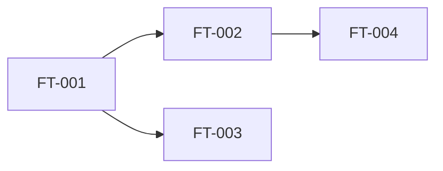

# [EP-001] Epic Name

## Description

<!-- High-level functional description of the epic -->

**Business objective:** <!-- What problem this epic solves -->

**Main actors:** [ACT-Hxxx], [ACT-Hxxx]

**Concerned entities:** [ENT-xxx], [ENT-xxx]

---

## Features

### [FT-001] Feature Name

| Property | Value |
|----------|-------|
| **Description** | <!-- What this feature enables --> |
| **Main actor** | [ACT-Hxxx] |
| **Priority** | Must / Should / Could / Won't (MoSCoW) |
| **Estimated complexity** | Low / Medium / High |
| **Dependencies** | <!-- Other features required before this one --> |
| **Associated business rules** | [BR-xxx], [BR-xxx] |

---

### [FT-002] Feature Name

| Property | Value |
|----------|-------|
| **Description** | |
| **Main actor** | |
| **Priority** | |
| **Estimated complexity** | |
| **Dependencies** | |
| **Associated business rules** | |

---

<!-- Repeat for each feature in the epic -->

## Dependencies between features

---

## Suggested implementation order

| Order | Feature | Justification |
|-------|---------|---------------|
| 1 | [FT-001] | Foundation required for the others |
| 2 | [FT-002] | Depends on [FT-001] |
| 3 | [FT-003] | Independent but high priority |

---

## Traceability

| Element | Detail |
|---------|--------|
| **Produced by** | agent-epics |
| **Production date** | YYYY-MM-DD |
| **Inputs used** | [VIS-001], [GLO-001], [ACT-001], [DOM-001] |
| **Validated by** | Pending |
| **Validation date** | Pending |
