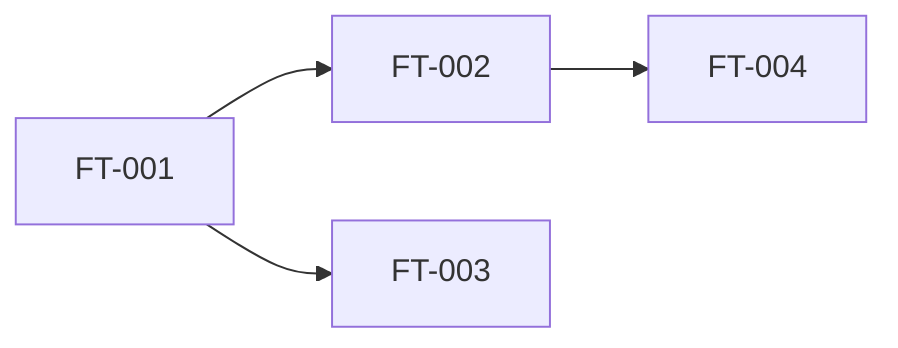

# [EP-001] Epic Name

## Description

<!-- High-level functional description of the epic -->

**Business objective:** <!-- What problem this epic solves, what value it delivers -->

**Main actors:** [ACT-Hxxx], [ACT-Hxxx]

**Concerned entities:** [ENT-xxx], [ENT-xxx]

**Covered requirements:** [EX-xxx], [EX-yyy]

---

## Feature index

> Detailed feature specifications are in individual `ft-xxx-{slug}.md` files in each feature sub-folder.
> Run `agent-2.2b-features.md` to generate them.

| ID | Feature name | Priority | Complexity | Dependencies | Path |
|----|-------------|----------|------------|--------------|------|
| [FT-001] | Feature name | Must | Medium | — | [ft-001-{slug}/ft-001-{slug}.md](ft-001-{slug}/ft-001-{slug}.md) |
| [FT-002] | Feature name | Should | Low | [FT-001] | [ft-002-{slug}/ft-002-{slug}.md](ft-002-{slug}/ft-002-{slug}.md) |
| [FT-003] | Feature name | Must | High | [FT-001] | [ft-003-{slug}/ft-003-{slug}.md](ft-003-{slug}/ft-003-{slug}.md) |

<!-- Add one row per feature. Priority: Must / Should / Could / Won't -->

---

## Dependencies between features

---

## Suggested implementation order

| Order | Feature | Justification |
|-------|---------|---------------|
| 1 | [FT-001] | Foundation required for the others |
| 2 | [FT-002] | Depends on [FT-001] |
| 3 | [FT-003] | Independent but high priority |

---

## Acceptance criteria

<!-- Macroscopic criteria that validate this epic delivers its business value.
     These are NOT User Story criteria — they test business outcomes that emerge
     when all features of this epic work together. Each criterion feeds the E2E test plan. -->

### EAC-001: <!-- Criterion name — end-to-end business outcome -->

- **Given** <!-- business context at scale (realistic volumes, multiple actors) -->
- **When** <!-- complete business flow spanning multiple features -->
- **Then** <!-- observable business outcome with measurable result -->

### EAC-002: <!-- Criterion name — cross-feature integration -->

- **Given** <!-- precondition involving multiple features of this epic -->
- **When** <!-- action that exercises feature integration -->
- **Then** <!-- expected integrated behaviour -->

<!-- Add one EAC per major business outcome this epic must deliver.
     Typical: 3-5 criteria per epic. Use EAC- prefix (Epic Acceptance Criterion). -->

---

## Definition of Ready

- [ ] All features [FT-xxx] of this epic have status `validated`
- [ ] All feature-level acceptance criteria are covered by E2E scenarios
- [ ] All cross-feature dependencies are resolved (no circular or missing)
- [ ] No BLOCK in validation reports for any feature of this epic
- [ ] Business rules referenced by this epic are all covered by test scenarios

---

## Points of attention

<!-- Known constraints, ambiguities, or risks to flag for the design phase -->

---

## Traceability

| Element | Detail |
|---------|--------|
| **Produced by** | agent-epics |
| **Production date** | YYYY-MM-DD |
| **Inputs used** | [VIS-001], [GLO-001], [ACT-001], [DOM-001], [EXF-001] |
| **Validated by** | Pending |
| **Validation date** | Pending |
