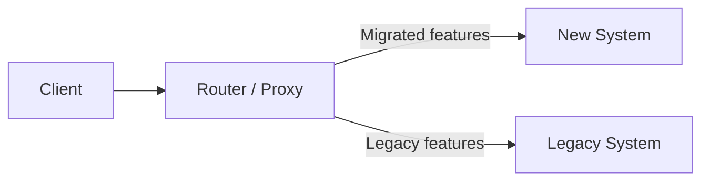

# Skill: Application Evolution Patterns (Brownfield)

## Objective

This skill provides the architectural and tactical patterns specific to brownfield projects. It is loaded by agents from System T0 and by agents from Systems T1/T2 when the project is an evolution of an existing application (`[GAP-001]` present in inputs).

---

## 1. Strangler Fig Pattern

### Description

Progressively replaces a legacy system by developing new components that intercept and redirect traffic as the migration proceeds. The legacy system is "strangled" progressively until it is entirely replaced.

### When to use it

- The legacy system is too large or too risky for a "big bang" migration
- New features can coexist with existing ones during a transition period
- Distinct parts of the system can be isolated and replaced independently

### Structure



### Implementation in the pipeline

1. **In `[GAP-001]` § Coexistence strategy**: define the boundary and routing mechanism
2. **In T2.3 Enablers**: create an enabler `ENB-xxx: Strangler Fig Proxy` (Wave 0 BF)
3. **In T2.5 Implementation plan**: waves correspond to progressively migrated domains

### Risks to document in ADRs

- Dual behaviour during transition (two sources of truth)
- Data synchronisation between legacy and new system
- Temporarily increased operational complexity

---

## 2. Anti-Corruption Layer (ACL)

### Description

An isolation layer that translates the concepts and model of the legacy system into the model of the new system, preventing legacy concepts from "contaminating" the new domain.

### When to use it

- The legacy system's data model or concepts are inconsistent with the new functional model
- Integrations with the legacy system must be maintained during the transition
- Refactoring the legacy is out of scope for the evolution

### Structure

```
[New System] → [ACL: Adapter] → [Legacy System]
```

### Implementation in the pipeline

1. **In `[GAP-001]` § Architecture gap**: identify legacy contamination zones as `[GAP-ARCH-xxx]`
2. **In T1.2 ADRs**: document the decision to use an ACL with the interfaces to adapt
3. **In T2.3 Enablers**: create an enabler `ENB-xxx: Anti-Corruption Layer — [Source System]`

### Application examples

- Adapting a legacy billing system that uses proprietary product codes
- Normalising heterogeneous order statuses from 3 different source systems
- Translating a denormalised relational schema to a clean Domain-Driven model

---

## 3. Feature Flags

### Description

A mechanism for conditionally enabling/disabling features without deployment, allowing progressive rollout and controlled coexistence of behaviours.

### When to use it

- A feature must be deployed but activated progressively (% of users, profiles)
- A data migration is long and must run in parallel with normal operations
- A modified behaviour must be rollbackable without redeployment

### Types of brownfield feature flags

| Type | Brownfield usage | Lifetime |
|------|-----------------|----------|
| **Release flag** | Enable the new version of a feature during migration | Short term — remove after full migration |
| **Migration flag** | Read from the old schema or the new one during transition | Medium term — remove when data migration is complete |
| **Killswitch** | Disable a problematic feature in production without redeployment | Short term — emergency use |

### Implementation in the pipeline

1. **In T1.2 ADRs**: create an ADR "Feature flags strategy" if the evolution requires a progressive rollout
2. **In T2.3 Enablers**: create an enabler `ENB-xxx: Feature Flag Infrastructure` (Wave 0 BF)
3. **In T2.5 Implementation plan**: each migration wave can rely on a feature flag

### Mandatory rule

Brownfield feature flags have a **limited lifetime** and a **removal criterion defined at creation time**. A feature flag without an end criterion is technical debt.

---

## 4. Parallel Run (Operational Duality)

### Description

Both systems (old and new) process the same data in parallel during a validation period. Results are compared to validate that the new system produces the same outputs as the old one.

### When to use it

- The legacy system's calculations or business rules are not fully documented
- The risk of regression is high and confidence in tests is insufficient
- Regulatory compliance requires period-by-period validation before switchover

### Application in the pipeline

1. **In `[GAP-001]` § Coexistence strategy**: identify modules that are candidates for parallel run
2. **In T2.4 Test strategy**: define comparison metrics (acceptable divergence)

---

## 5. Strangler + Database Decomposition

### Brownfield multi-domain specific pattern

When a monolithic database schema must be decomposed into sub-domains:

### Recommended sequence

1. **Identify bounded contexts** in the existing schema (tables by domain)
2. **Create compatibility views** (`CREATE VIEW`) to maintain existing cross-domain joins
3. **Migrate data access** to the new domain model domain by domain
4. **Remove the views** once consumers are migrated
5. **Physically extract** the schema if the objective is separation (optional)

### Implementation in the pipeline

- **In T2.1 Data Model in brownfield mode**: compatibility views are `ALTER` elements in `[GAP-DAT-xxx]`
- **In T2.3 Enablers**: create a compatibility view setup enabler in Wave 0 BF

---

## 6. Pattern selection checklist

For each brownfield evolution, select the appropriate pattern(s):

| Situation | Recommended pattern |
|-----------|-------------------|
| Partial redesign with required coexistence | Strangler Fig |
| Legacy model inconsistent with the new domain | Anti-Corruption Layer |
| Risky deployment requiring easy rollback | Feature Flags |
| Undocumented legacy calculations to validate | Parallel Run |
| Monolithic schema to decompose | Strangler + Database Decomposition |
| All brownfield evolutions | Feature Flags (at minimum for major changes) |
