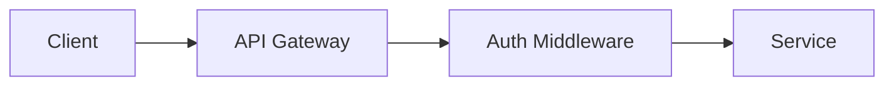

---
id: ENB-001
title: "[Technical enabler title]"
system: t2-design
type: enabler
status: draft
version: "1.0"
last_updated: YYYY-MM-DD
author: agent-t2.3-enablers
reviewers: []
dependencies: ["CTX-001", "STK-001"]
ba_dependencies: []
adr_reference: ADR-xxx
priority: Must
---

# [ENB-001] Technical enabler title

## Description

<!-- 
Description of the enabler: what cross-cutting need does it address?
Why is it necessary before the stories are implemented?
-->

---

## Context

| Property | Value |
|----------|-------|
| **Motivating ADR** | [ADR-xxx] — <!-- ADR title --> |
| **Category** | Infrastructure / Security / Observability / Cross-cutting / DevOps |
| **Priority** | Must / Should / Could |
| **Implementation wave** | <!-- Wave 0 (setup) / Wave 1 (foundation) / Wave 2 (application) --> |
| **Enabler dependencies** | [ENB-xxx] <!-- Other prerequisite enablers --> |
| **Unlocked stories** | [US-xxx], [US-xxx] <!-- Stories that require this enabler --> |

---

## Specification

### Scope

<!-- Describe precisely what the enabler covers and does NOT cover -->

**Included:**
- <!-- Element 1 -->
- <!-- Element 2 -->

**Excluded:**
- <!-- Excluded element with justification -->

### Required configuration

| Parameter | Value | Environment | Secret |
|-----------|-------|-------------|--------|
| <!-- E.g. DATABASE_URL --> | <!-- E.g. postgresql://... --> | All | No |
| <!-- E.g. JWT_SECRET --> | <!-- E.g. *** --> | All | Yes |
| <!-- E.g. OAUTH_CLIENT_ID --> | <!-- E.g. *** --> | All | Yes |

### Architecture

<!-- Diagram or description of the enabler architecture -->

---

## Acceptance criteria

### AC-001: <!-- Criterion name (nominal case) -->

- **Given** <!-- initial context with concrete values -->
- **When** <!-- triggering action -->
- **Then** <!-- expected verifiable result -->
- **And** <!-- additional result (optional) -->

### AC-002: <!-- Criterion name (alternative case) -->

- **Given** <!-- context -->
- **When** <!-- action -->
- **Then** <!-- result -->

### AC-003: <!-- Criterion name (error case) -->

- **Given** <!-- context with error situation -->
- **When** <!-- action -->
- **Then** <!-- expected behaviour on error -->

---

## Implementation sub-tasks

| # | Sub-task | Description | Estimate |
|---|---------|-------------|----------|
| 1 | Configuration | <!-- E.g. Env var setup, config files --> | |
| 2 | Implementation | <!-- E.g. Middleware, service, module code --> | |
| 3 | Tests | <!-- E.g. Unit tests + integration tests --> | |
| 4 | Documentation | <!-- E.g. Update CLAUDE.md, project README --> | |

---

## Tests to perform

| Type | Description | Tool |
|------|-------------|------|
| Unit | <!-- E.g. Test of the authentication service in isolation --> | <!-- Jest / JUnit --> |
| Integration | <!-- E.g. Test with a real database --> | <!-- Testcontainers --> |
| Smoke test | <!-- E.g. Health check verification in deployed env --> | <!-- curl / Playwright --> |

---

## Traceability

### Technical traceability
| Element | Detail |
|---------|--------|
| **Produced by** | agent-t2.3-enablers |
| **Production date** | YYYY-MM-DD |
| **Technical inputs** | [CTX-001], [ADR-xxx], [STK-001] |
| **Validated by** | Pending |
| **Validation date** | Pending |

### BA traceability
| BA Deliverable | Traced elements |
|----------------|-----------------|
| [ACT-001] | Roles requiring this enabler (if security) |
| [VIS-001] | Constraints motivating this enabler |
