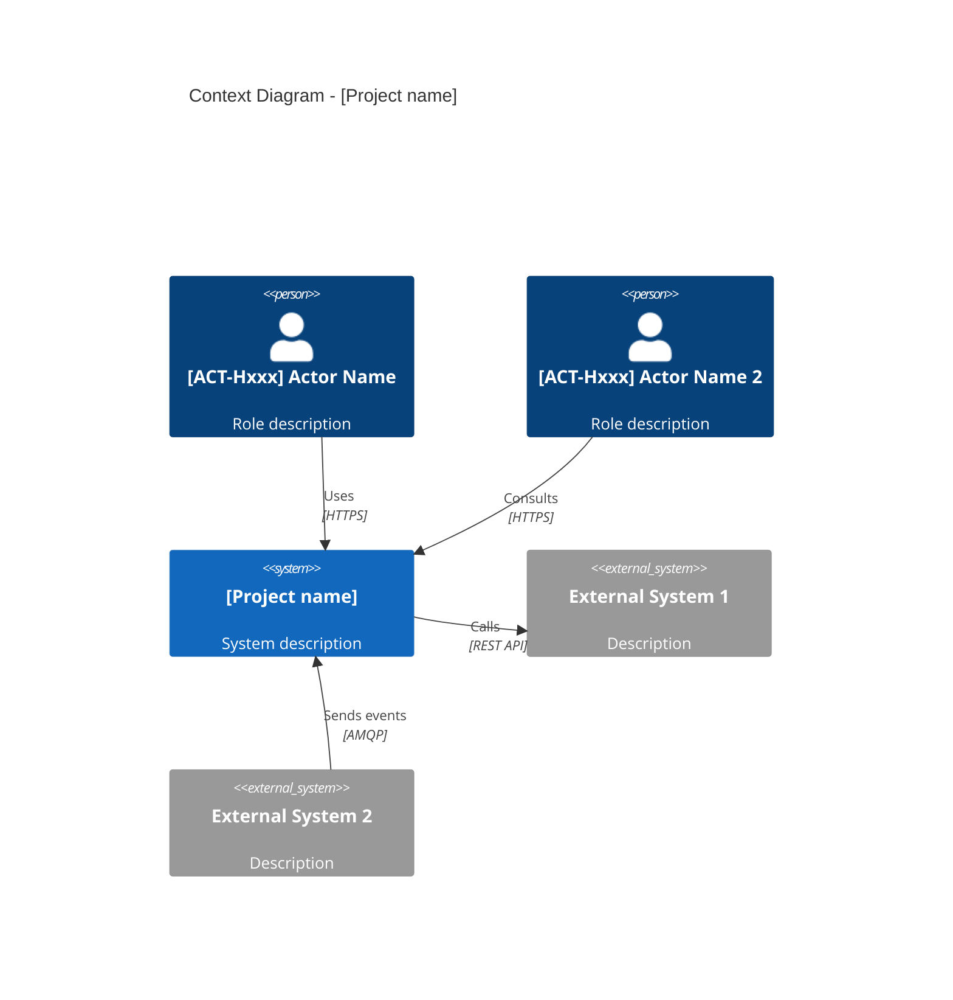
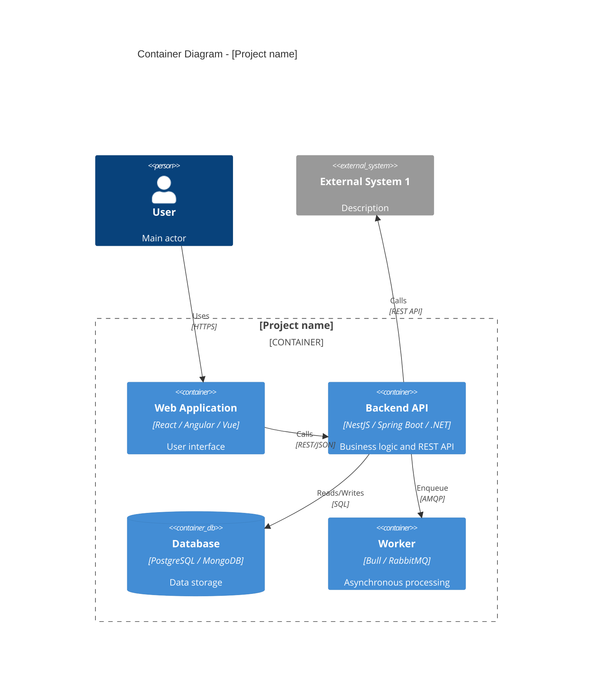

---
id: CTX-001
title: "System Context — [Project Name]"
system: t1-architecture
type: system-context
status: draft
version: "1.0"
last_updated: YYYY-MM-DD
author: agent-t1.1-system-context
reviewers: []
dependencies: []
ba_dependencies: ["VIS-001", "DOM-001"]
---

# [CTX-001] System Context

## 1. Overview

<!-- Concise description of the system to build, its role in the ecosystem, its main users -->

### Context diagram (C4 Level 1)

---

## 2. System boundaries

### In scope (IN)

| # | Component | Description | BA Ref |
|---|-----------|-------------|--------|
| 1 | <!-- Component --> | <!-- Description --> | [VIS-001] §Scope IN |
| 2 | | | |

### Out of scope (OUT)

| # | Component | Reason for exclusion | BA Ref |
|---|-----------|---------------------|--------|
| 1 | <!-- Component --> | <!-- Reason --> | [VIS-001] §Scope OUT |
| 2 | | | |

---

## 3. External systems inventory

### [CTX-EXT-001] External system name

| Property | Value |
|----------|-------|
| **Type** | REST API / Message Broker / Shared database / File / SFTP / ... |
| **Flow direction** | Inbound / Outbound / Bidirectional |
| **Protocol** | HTTPS / AMQP / SFTP / JDBC / ... |
| **Data format** | JSON / XML / CSV / ... |
| **Authentication** | API Key / OAuth2 / mTLS / ... |
| **Criticality** | High / Medium / Low |
| **Expected SLA** | <!-- E.g. 99.9%, response time < 500ms --> |
| **Owner** | <!-- Responsible team or vendor --> |
| **Documentation** | <!-- Link to API doc if available --> |

**Data flows:**

| Direction | Exchanged data | Frequency | Estimated volume |
|-----------|---------------|-----------|-----------------|
| → (outbound) | <!-- E.g. Invoice creation --> | <!-- E.g. Real-time, each validated order --> | <!-- E.g. ~100/day --> |
| ← (inbound) | <!-- E.g. Payment status --> | <!-- E.g. Webhook --> | <!-- E.g. ~100/day --> |

### [CTX-EXT-002] External system name 2

<!-- Repeat the same structure -->

---

## 4. Container diagram (C4 Level 2)

---

## 5. Environment constraints

| Category | Constraint | Impact on architecture |
|----------|------------|----------------------|
| **Hosting** | <!-- On-premise / Cloud AWS / Cloud Azure / Hybrid --> | <!-- Impact --> |
| **Network** | <!-- VPN, IP whitelisting, proxy... --> | <!-- Impact --> |
| **Security** | <!-- Imposed standards: SOC2, ISO 27001, GDPR... --> | <!-- Impact --> |
| **Performance** | <!-- Number of concurrent users, expected response time --> | <!-- Impact --> |
| **Availability** | <!-- Expected SLA, fault tolerance --> | <!-- Impact --> |
| **Imposed technologies** | <!-- Stack mandated by IT if applicable --> | <!-- Impact --> |
| **Infrastructure budget** | <!-- Budget constraints --> | <!-- Impact --> |

---

## 6. Integration assumptions

| # | Assumption | Impact if false | To confirm with |
|---|-----------|----------------|----------------|
| H-001 | <!-- E.g. The external system exposes a documented REST API --> | <!-- Impact --> | <!-- Who --> |
| H-002 | | | |

---

## Traceability

### Technical traceability
| Element | Detail |
|---------|--------|
| **Produced by** | agent-t1.1-system-context |
| **Production date** | YYYY-MM-DD |
| **Technical inputs** | Environmental constraint documents |
| **Validated by** | Pending |
| **Validation date** | Pending |

### BA traceability
| BA Deliverable | Traced elements |
|----------------|-----------------|
| [VIS-001] | Scope IN/OUT, business constraints |
| [DOM-001] | Entities to identify data flows |
| [ACT-001] | Human actors and systems in the C4 diagram |
