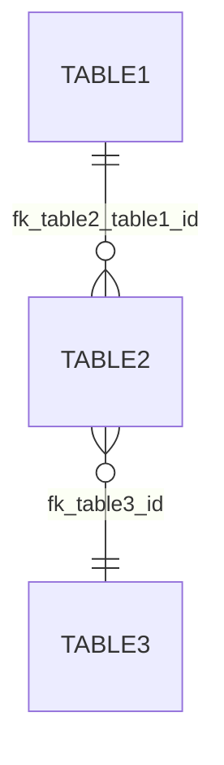

---
id: TECH-ASIS-001
title: "Technical As-Is Audit — [Project Name]"
phase: t0-audit
type: technical-as-is-audit
status: draft
version: "1.0"
last_updated: YYYY-MM-DD
author: agent-t0.1-audit-technique
reviewers: []
dependencies: []
audit_mode: "A"  # A = Full access | B = Partial access | C = Minimal access
---

# [TECH-ASIS-001] Technical As-Is Audit

## 1. Existing stack summary

**Identifier:** `[TECH-ASIS-STK-001]`

| Component | Technology | Version | EOL / Risk |
|-----------|-----------|---------|------------|
| Language | | | |
| Back-end framework | | | |
| Front-end framework | | | |
| Database | | | |
| ORM / Data layer | | | |
| Runtime | | | |
| Dependency manager | | | |
| Test framework | | | |

**Major libraries:**

| Library | Role | Version |
|---------|------|---------|
| | | |

---

## 2. As-is data schema

**Identifier:** `[TECH-ASIS-DAT-001]`

**Confidence level:** High / Medium / Low

### Tables

| Table | Functional description | PK (type) | Audit columns | Estimated rows |
|-------|----------------------|-----------|---------------|----------------|
| | | UUID / SERIAL / Other | created_at / updated_at / deleted_at | |

### Key relationships

| Source table | Target table | Cardinality | ON DELETE |
|-------------|-------------|-------------|-----------|
| | | 1:N / N:M | CASCADE / SET NULL / RESTRICT |

### Observations

- <!-- Missing columns relative to target conventions -->
- <!-- Orphan tables or tables without a standard primary key -->
- <!-- Notable missing indexes -->

---

## 3. Exposed as-is APIs

**Identifier:** `[TECH-ASIS-API-001]`

**Confidence level:** High / Medium / Low *(partial list if Medium/Low)*

| Method | Path | Functional description | Auth required | Versioned |
|--------|------|----------------------|---------------|-----------|
| GET | | | Yes / No | Yes / No |
| POST | | | | |

**Error response format:**
<!-- Standard (RFC 7807 Problem Details) / Ad hoc structure / Unknown -->

**Authentication mechanism:**
<!-- JWT Bearer / Session cookie / API Key / OAuth2 / Other / Unknown -->

---

## 4. As-is application architecture

**Identifier:** `[TECH-ASIS-ARCH-001]`

**Architecture style:** Monolith / Microservices / Modular / Other

**Main pattern:** MVC / Clean Architecture / Layered / Other / Not identifiable

**Identified modules / Bounded contexts:**

| Module | Responsibility | Internal dependencies |
|--------|---------------|----------------------|
| | | |

**Observations:**
- <!-- Observed anti-patterns (factual, no judgement) -->
- <!-- Tight couplings or circular dependencies -->

---

## 5. As-is external integrations

| ID | External system | Type | Direction | Auth | Criticality | Status |
|----|----------------|------|-----------|------|-------------|--------|
| [TECH-ASIS-INT-001] | | REST / SOAP / Queue / SFTP | In / Out / Bi | | Critical / Important / Secondary | Functional / Problematic / Abandoned |

---

## 6. As-is infrastructure

**Identifier:** `[TECH-ASIS-INFRA-001]`

**Hosting:** Cloud (AWS / Azure / GCP) / On-premise / Shared hosting / Other

**Containerisation:** Docker / Kubernetes / None

**CI/CD:** <!-- Tool and pipeline status -->

**Available environments:**

| Environment | URL (if known) | Separate database |
|------------|----------------|-------------------|
| Development | | Yes / No / Shared |
| Staging / UAT | | |
| Production | | |

**Local startup procedure:** <!-- Document commands if known -->

---

## 7. Existing tests

**Identifier:** `[TECH-ASIS-TEST-001]`

| Test type | Framework | Estimated coverage | CI execution |
|-----------|-----------|-------------------|--------------|
| Unit | | | Yes / No |
| Integration | | | Yes / No |
| E2E | | | Yes / No |

---

## 8. Deviations from target conventions

> Comparison with skills from the technical registry (`shared/skill-registry/`) for the identified stack.

| Target convention | Present in existing | Observed deviation | Impact |
|-------------------|--------------------|--------------------|--------|
| Audit columns `created_at` / `updated_at` | Partial / No / Yes | | Blocking / Optional |
| Unit tests ≥ 80% | | | |
| Environment variables via `.env` | | | |
| UUID PK | | | |
| Versioned migrations (tool) | | | |
| Standardised error handling | | | |

---

## 9. Audit quality

| Section | Completeness | Confidence | Mode |
|---------|-------------|------------|------|
| Stack | | High / Medium / Low | A / B / C |
| Data schema | | | |
| APIs | | | |
| Architecture | | | |
| Integrations | | | |
| Infrastructure | | | |
| Tests | | | |

---

## 10. Traceability

| Downstream deliverable | Dependency |
|------------------------|------------|
| [GAP-001] | Main input of agent-t0.2-gap-technique |

---

## Attention Points

> ⚠️ **[PA-001]** <!-- Unknown element or requiring clarification -->
