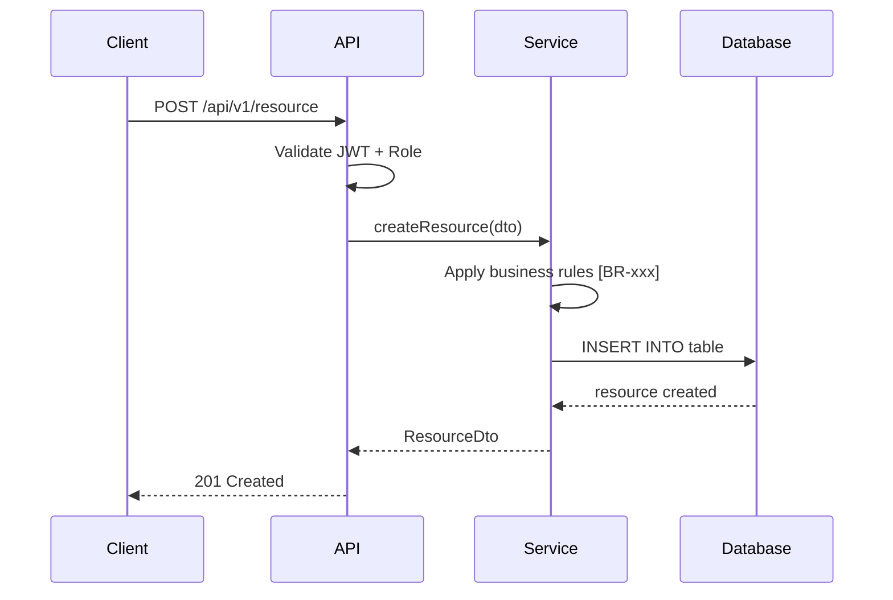

---
id: API-001
title: "API Contracts — [Project Name]"
system: t2-design
type: api-contract
status: draft
version: "1.0"
last_updated: YYYY-MM-DD
author: agent-t2.2-api-contracts
reviewers: []
dependencies: ["CTX-001", "ADR-001", "STK-001", "DAT-001"]
ba_dependencies: ["DOM-001", "BRL-001", "ACT-001"]
---

# [API-001] API Contracts & Events

## 1. General conventions

| Property | Value |
|----------|-------|
| **Base URL** | `https://<host>/api/v1` |
| **Format** | JSON (Content-Type: application/json) |
| **Authentication** | Bearer JWT |
| **Versioning** | Path prefix (`/api/v1/...`) |
| **Pagination** | `?page=1&pageSize=20` → response `{ data: [...], meta: { total, page, pageSize } }` |
| **Sorting** | `?sort=field&order=asc|desc` |
| **Filtering** | `?field=value` (simple filters) |
| **Errors** | Standardised format (see below) |

### Standard error format

```json
{
  "error": "ERROR_CODE",
  "message": "Human-readable message",
  "details": [
    { "field": "email", "message": "Email format is invalid" }
  ],
  "timestamp": "2025-01-15T10:30:00Z",
  "requestId": "uuid"
}
```

### Error codes

| HTTP Code | Error code | Description |
|-----------|------------|-------------|
| 400 | `VALIDATION_ERROR` | Invalid input data |
| 401 | `UNAUTHORIZED` | Token absent or invalid |
| 403 | `FORBIDDEN` | Insufficient permissions |
| 404 | `NOT_FOUND` | Resource not found |
| 409 | `CONFLICT` | State conflict (e.g. invalid transition) |
| 422 | `BUSINESS_RULE_VIOLATION` | Business rule violation |
| 500 | `INTERNAL_ERROR` | Server error |

---

## 2. Stories → Endpoints mapping

| User Story | Endpoint | Method | Description |
|------------|----------|--------|-------------|
| [US-xxx] | `/api/v1/<resource>` | POST | <!-- Description --> |
| [US-xxx] | `/api/v1/<resource>/{id}` | GET | <!-- Description --> |
| [US-xxx] | `/api/v1/<resource>` | GET | <!-- Description --> |
| [US-xxx] | `/api/v1/<resource>/{id}` | PATCH | <!-- Description --> |
| [US-xxx] | `/api/v1/<resource>/{id}` | DELETE | <!-- Description --> |

---

## 3. Endpoints

### [API-001] POST /api/v1/resource

**Description:** <!-- Operation description -->

**Implemented stories:** [US-xxx]
**Applied business rules:** [BR-xxx], [BR-xxx]
**Impacted tables:** [TBL-xxx]
**Required role:** `[ROL-xxx]`

#### Request

**Headers:**
| Header | Value | Mandatory |
|--------|-------|-----------|
| Authorization | `Bearer <jwt>` | Yes |
| Content-Type | `application/json` | Yes |

**Body (DTO: CreateResourceDto):**

```json
{
  "field1": "string",
  "field2": 0,
  "nested": {
    "subField": "string"
  }
}
```

| Field | Type | Mandatory | Constraint | Description | BA Ref |
|-------|------|-----------|------------|-------------|--------|
| field1 | string | Yes | Max 100 chars | <!-- description --> | [ENT-xxx].attribute |
| field2 | number | Yes | > 0 | <!-- description --> | [BR-xxx] |
| nested.subField | string | No | | <!-- description --> | |

#### Responses

**201 Created:**
```json
{
  "id": "uuid",
  "field1": "string",
  "field2": 0,
  "status": "draft",
  "createdAt": "2025-01-15T10:30:00Z"
}
```

**400 Bad Request:**
```json
{
  "error": "VALIDATION_ERROR",
  "message": "Validation failed",
  "details": [
    { "field": "field2", "message": "Must be greater than 0" }
  ]
}
```

**401 Unauthorized / 403 Forbidden / 422 Business Rule Violation**

#### Sequence diagram



---

### [API-002] GET /api/v1/resource/{id}

<!-- Repeat the same structure for each endpoint -->

---

### [API-003] GET /api/v1/resource

**Description:** Paginated list of resources

**Implemented stories:** [US-xxx]
**Required role:** `[ROL-xxx]`

#### Request

**Query Parameters:**

| Param | Type | Mandatory | Default | Description |
|-------|------|-----------|---------|-------------|
| page | integer | No | 1 | Page number |
| pageSize | integer | No | 20 | Number of items per page |
| sort | string | No | `createdAt` | Sort field |
| order | string | No | `desc` | Sort direction (asc/desc) |
| status | string | No | — | Filter by status |

#### Response

**200 OK:**
```json
{
  "data": [
    { "id": "uuid", "field1": "string", "status": "draft" }
  ],
  "meta": {
    "total": 42,
    "page": 1,
    "pageSize": 20,
    "totalPages": 3
  }
}
```

---

## 4. Asynchronous events (if applicable)

### [API-EVT-001] Event name

| Property | Value |
|----------|-------|
| **Type** | Domain Event |
| **Trigger** | <!-- Action that produces the event --> |
| **Channel** | <!-- Queue / Topic name --> |
| **Producer** | <!-- Module that emits --> |
| **Consumer(s)** | <!-- Module(s) that listen --> |
| **BA Story** | [US-xxx] |
| **BA Rule** | [BR-TRG-xxx] |

**Payload:**
```json
{
  "eventType": "ResourceCreated",
  "timestamp": "2025-01-15T10:30:00Z",
  "data": {
    "resourceId": "uuid",
    "field1": "value"
  }
}
```

---

## 5. OpenAPI file (reference)

The complete contract is also available in OpenAPI 3.0 format in the `openapi.yaml` file at the project root. This file takes precedence in case of divergence with this document.

---

## Traceability

### Technical traceability
| Element | Detail |
|---------|--------|
| **Produced by** | agent-t2.2-api-contracts |
| **Production date** | YYYY-MM-DD |
| **Technical inputs** | [CTX-001], [ADR-xxx], [STK-001], [DAT-001] |
| **Validated by** | Pending |
| **Validation date** | Pending |

### BA traceability
| BA Deliverable | Traced elements |
|----------------|-----------------|
| [US-xxx] | Stories → Endpoints |
| [UF-xxx] | User journeys → API call sequences |
| [BRL-001] | Rules → Validations and business constraints |
| [ACT-001] | Roles → Authentication guards |
| [DOM-001] | Entities → DTOs and response models |
