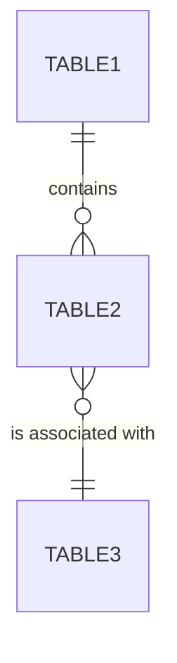

---
id: DAT-001
title: "Physical Data Model — [Project Name]"
system: t2-design
type: data-model
status: draft
version: "1.0"
last_updated: YYYY-MM-DD
author: agent-t2.1-data-model
reviewers: []
dependencies: ["CTX-001", "ADR-001", "STK-001"]
ba_dependencies: ["DOM-001", "BRL-001", "GLO-001"]
---

# [DAT-001] Physical Data Model

## 1. Overview (ERD)



---

## 2. BA Domain → Physical Model mapping

| BA Entity | BA ID | Physical Table(s) | Table ID | Note |
|-----------|-------|-------------------|----------|------|
| <!-- Order --> | [ENT-xxx] | <!-- orders --> | [TBL-xxx] | 1:1 mapping |
| <!-- OrderLine --> | [ENT-xxx] | <!-- order_lines --> | [TBL-xxx] | 1:1 mapping |
| <!-- History --> | [ENT-xxx] | <!-- audit_logs --> | [TBL-xxx] | Generalisation |

---

## 3. Tables

### [TBL-001] table_name

**BA Entity:** [ENT-xxx] EntityName
**Glossary term:** [GLO-Txxx]

#### Columns

| Column | SQL Type | Nullable | Default | Constraint | Description | BA Ref |
|--------|---------|----------|---------|------------|-------------|--------|
| id | UUID | NO | `gen_random_uuid()` | PK | Unique identifier | |
| <!-- column --> | <!-- type --> | <!-- YES/NO --> | <!-- default --> | <!-- FK, CHECK, UNIQUE --> | <!-- description --> | [BR-xxx] |
| status | VARCHAR(20) | NO | `'draft'` | CHECK (see below) | Current state | [ENT-xxx] lifecycle |
| created_at | TIMESTAMPTZ | NO | `NOW()` | | Creation date | |
| updated_at | TIMESTAMPTZ | NO | `NOW()` | | Last modification | |

#### CHECK Constraints

| Name | Expression | BA Business Rule |
|------|-----------|-----------------|
| `chk_<table>_<rule>` | `CHECK (column > 0)` | [BR-xxx] |
| `chk_<table>_status` | `CHECK (status IN ('draft', 'validated', 'cancelled'))` | [ENT-xxx] lifecycle |

#### Indexes

| Name | Columns | Type | Justification |
|------|---------|------|---------------|
| `idx_<table>_<col>` | <!-- column(s) --> | BTREE / GIN / ... | <!-- Frequent query that benefits from this index --> |

#### Foreign keys

| Column | Referenced table | Referenced column | On Delete | On Update |
|--------|-----------------|------------------|-----------|-----------|
| <!-- fk_col --> | <!-- table_ref --> | <!-- col_ref --> | CASCADE / SET NULL / RESTRICT | CASCADE |

### [TBL-002] table_name_2

<!-- Repeat the same structure for each table -->

---

## 4. Types and Enums

### Type: type_enum_name

**BA reference data:** [REF-xxx]

```sql
CREATE TYPE order_status AS ENUM ('draft', 'validated', 'shipped', 'delivered', 'cancelled');
```

| Value | BA Label | Description |
|-------|----------|-------------|
| `draft` | Draft | Order being created |
| `validated` | Validated | Confirmed order |
| `cancelled` | Cancelled | Cancelled order |

---

## 5. Business rule coverage

| BA Rule | Type | Technical implementation | Table(s) |
|---------|------|--------------------------|----------|
| [BR-VAL-xxx] | Validation | CHECK constraint `chk_xxx` | [TBL-xxx] |
| [BR-CAL-xxx] | Calculation | Computed column or service logic | [TBL-xxx] |
| [BR-COH-xxx] | Consistency | Trigger or FK constraint | [TBL-xxx], [TBL-yyy] |
| [BR-TRG-xxx] | Trigger | Application event (not in DB) | — |

---

## 6. Migration strategy

| Property | Value |
|----------|-------|
| **Tool** | <!-- Flyway / Liquibase / Prisma Migrate / TypeORM migrations / Alembic / ... --> |
| **Versioning** | <!-- Sequential numbering: 001_, 002_, ... --> |
| **Rollback** | <!-- Each migration has its DOWN script --> |
| **Environments** | <!-- dev → staging → production --> |
| **Initial data (seed)** | <!-- Reference data [REF-xxx] + test data --> |

### Migration scripts

```sql
-- Migration: 001_create_<table>.sql
-- Implements: [TBL-001], [ENT-xxx]
-- BA References: [DOM-001], [BR-xxx]

CREATE TABLE table_name (
    -- columns as defined above
);

-- Index
CREATE INDEX idx_<table>_<col> ON table_name(<col>);
```

---

## 7. Seed data (reference)

```sql
-- Seed: 001_seed_reference_data.sql
-- Implements: [REF-xxx]

INSERT INTO reference_table (code, label, active) VALUES
('CODE1', 'Label 1', true),
('CODE2', 'Label 2', true);
```

---

## Traceability

### Technical traceability
| Element | Detail |
|---------|--------|
| **Produced by** | agent-t2.1-data-model |
| **Production date** | YYYY-MM-DD |
| **Technical inputs** | [CTX-001], [ADR-xxx] (data strategy), [STK-001] |
| **Validated by** | Pending |
| **Validation date** | Pending |

### BA traceability
| BA Deliverable | Traced elements |
|----------------|-----------------|
| [DOM-001] | Entities [ENT-xxx] → Tables [TBL-xxx] |
| [BRL-001] | Rules [BR-xxx] → CHECK constraints, indexes, triggers |
| [GLO-001] | Terms → Table and column names |
