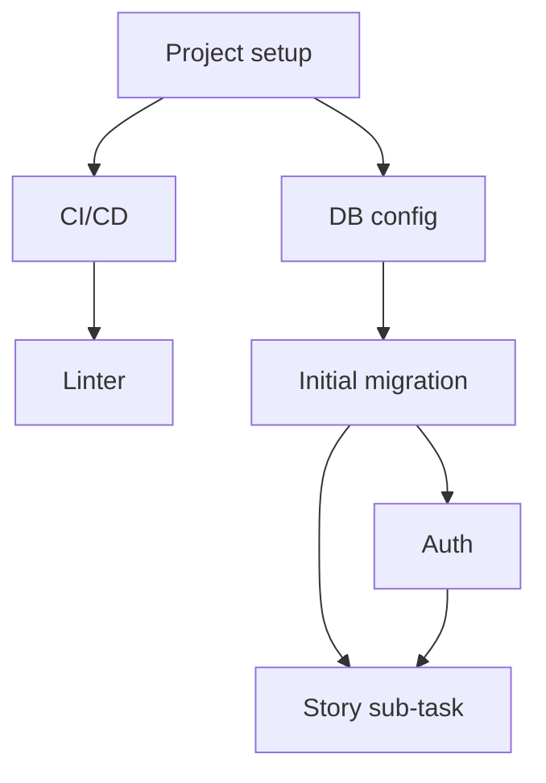

---
id: IMP-001
title: "Implementation Plan — [Project Name]"
system: t2-design
type: implementation-plan
status: draft
version: "1.0"
last_updated: YYYY-MM-DD
author: agent-t2.5-implementation-plan
reviewers: []
dependencies: ["CTX-001", "DAT-001", "API-001", "STK-001", "TST-001"]
ba_dependencies: ["EF-001", "US-001"]
enabler_dependencies: []
wave_count: 0
total_items: 0
critical_path_days: 0
---

# [IMP-001] Implementation Plan — [Project name]

## 1. Executive summary

| Field | Value |
|-------|-------|
| Number of waves | <!-- e.g. 5 --> |
| Total number of items | <!-- e.g. 42 --> |
| Critical path | <!-- e.g. Wave 0 → 1 → 2 → Release (14d) --> |
| Final target coverage | ≥ 90% unit / ≥ 80% integration |
| Enablers | <!-- e.g. 8 --> |
| User Stories | <!-- e.g. 15 --> |
| NFR items | <!-- e.g. 4 — or "none" --> |

---

## 2. Implementation waves

> **Mandatory parsing rule**: each row in the wave table has exactly the columns `wave_id`, `item_id`, `title`, `type`, `story_ref`, `estimate_h`, `deliverable`. The `story_ref` field is empty for enablers.

### Wave 0 — Setup & Foundations

| wave_id | item_id | title | type | story_ref | estimate_h | deliverable |
|---------|---------|-------|------|-----------|-----------|-------------|
| W0 | IMP-001 | Project setup [framework] | enabler | | 2 | Project initialised |
| W0 | IMP-002 | CI/CD configuration | enabler | | 3 | Pipeline functional |
| W0 | IMP-003 | Linter / formatter configuration | enabler | | 1 | Linter OK |

### Wave 1 — Infrastructure

| wave_id | item_id | title | type | story_ref | estimate_h | deliverable |
|---------|---------|-------|------|-----------|-----------|-------------|
| W1 | IMP-004 | Database + ORM configuration | enabler | | 3 | DB connection established |
| W1 | IMP-005 | Initial migration | enabler | | 2 | Base schema created |
| W1 | IMP-006 | Authentication configuration | enabler | | 4 | Auth operational |

### Wave N — Feature [Epic Name]

| wave_id | item_id | title | type | story_ref | estimate_h | deliverable |
|---------|---------|-------|------|-----------|-----------|-------------|
| WN | IMP-XXX | [Sub-task title] — backend | story-subtask | US-XXX | 4 | Functional endpoints |
| WN | IMP-XXX | [Sub-task title] — tests | story-subtask | US-XXX | 2 | Passing tests |
| WN | IMP-XXX | [Sub-task title] — front-end | story-subtask | US-XXX | 3 | Component delivered |
| WN | IMP-XXX | Playwright MCP validation [SCE-XXX] | playwright-validation | US-XXX | 1 | Selectors collected |
| WN | IMP-XXX | Playwright E2E tests CI | playwright-codegen | US-XXX | 2 | CI script generated |

### Wave NFR — Non-Functional Tests

> ⚠️ **Mandatory NFR gate**: this wave only starts if stories `EP-TECH-NFR-TESTS` have moved from `Pending Workshop` to `To Do` by `agent-nfr-test-specs.md`. If no `[NFR-TEST-xxx]` exists in `[TST-001]`, this wave is explicitly omitted and the following mention must appear: `<!-- NFR WAVE OMITTED: no NFR item identified in [TST-001] -->`.

| wave_id | item_id | title | type | story_ref | estimate_h | deliverable |
|---------|---------|-------|------|-----------|-----------|-------------|
| WNFR | IMP-NFR-001 | [NFR-TEST-001 title] | nfr-test | NFR-TEST-001 | To estimate | Script + CI config |
| WNFR | IMP-NFR-002 | [NFR-TEST-002 title] | nfr-test | NFR-TEST-002 | To estimate | Script + CI config |

---

## 3. Implementation queue (machine-readable)

> **⚠️ Critical section**: this JSON block is read directly by the coding agent orchestrator to generate the implementation queue. The format is strict — do not modify the key structure. Every item listed in the wave tables must appear here.

```json
{
  "project": "[project-name]",
  "generated_at": "YYYY-MM-DD",
  "plan_ref": "IMP-001",
  "total_items": 0,
  "waves": [
    {
      "wave_id": "W0",
      "name": "Setup & Foundations",
      "gate_before": null,
      "items": [
        {
          "id": "IMP-001",
          "title": "Project setup [framework]",
          "type": "enabler",
          "story_ref": null,
          "estimate_h": 2,
          "deps": [],
          "priority": 1
        },
        {
          "id": "IMP-002",
          "title": "CI/CD configuration",
          "type": "enabler",
          "story_ref": null,
          "estimate_h": 3,
          "deps": ["IMP-001"],
          "priority": 2
        }
      ]
    },
    {
      "wave_id": "W1",
      "name": "Infrastructure",
      "gate_before": "GATE-W0",
      "items": [
        {
          "id": "IMP-004",
          "title": "Database + ORM configuration",
          "type": "enabler",
          "story_ref": null,
          "estimate_h": 3,
          "deps": ["IMP-001"],
          "priority": 1
        }
      ]
    },
    {
      "wave_id": "WNFR",
      "name": "Non-Functional Tests",
      "gate_before": "GATE-NFR",
      "nfr_gate_required": true,
      "items": [
        {
          "id": "IMP-NFR-001",
          "title": "[NFR-TEST-001 title]",
          "type": "nfr-test",
          "story_ref": "NFR-TEST-001",
          "estimate_h": null,
          "deps": [],
          "priority": 1
        }
      ]
    }
  ]
}
```

---

## 4. Validation gates between waves

> **Rule**: a gate with `blocking: true` forbids starting the next wave until the criterion is fully satisfied. The orchestrator must check this table before pushing a new wave.

| gate_id | between | criterion | blocking | responsible |
|---------|---------|-----------|----------|-------------|
| GATE-W0 | W0 → W1 | Project compiles, CI passes empty, linter OK | true | Coding agent |
| GATE-W1 | W1 → W2 | Migration executed, DB connection OK, auth operational, stub enablers Done, app starts per `[STK-001] § Local startup` | true | Coding agent |
| GATE-ENV | before first Playwright navigation | App responds to readiness check, external system stubs active, seeds in place | true | Coding agent |
| GATE-WN | WN → WN+1 | Passing tests, coverage ≥ 90%, XRay Test Execution 100% PASSED | true | Coding agent |
| GATE-NFR | last functional wave → WNFR | Client workshop completed, thresholds defined, `agent-nfr-test-specs.md` executed, stories `EP-TECH-NFR-TESTS` in `To Do` | true | Human + Coding agent |
| GATE-RELEASE | WNFR → Release | All `NFR-TEST-xxx` with `Critical` criticality are PASSED within their thresholds | true | Coding agent |

---

## 5. Required enablers (execution prerequisites)

> All enablers listed here must be in `Done` state before stories from subsequent waves can start.

| enabler_id | title | wave | required_state | blocks |
|-----------|-------|-------|----------------|--------|
| ENB-XXX | [Enabler title] | W0 | Done | W2+ stories |
| ENB-STUB-XXX | Stub [external system] | W1 | Done | Playwright gate (GATE-ENV) |

---

## 6. Dependency graph



---

## 7. Estimates and metrics

### Summary by wave

| wave | nb_items | total_h | unit_coverage_target | integration_coverage_target | completed_stories |
|------|---------|---------|---------------------|----------------------------|-------------------|
| W0 | <!-- nb --> | <!-- h --> | — | — | 0 |
| W1 | <!-- nb --> | <!-- h --> | — | — | 0 |
| WN | <!-- nb --> | <!-- h --> | 80% | 60% | <!-- n/total --> |
| Final | <!-- nb --> | <!-- h --> | 90% | 80% | <!-- total/total --> |

### Critical path

```
[IMP-001] → [IMP-004] → [IMP-005] → ... → [IMP-XXX] = XX days
```

### Identified parallelisms

| wave | parallelisable items | condition |
|------|---------------------|-----------|
| WN | IMP-XXX, IMP-YYY | No dependency between them, same DB schema |

---

## 8. Target quality metrics

| metric | threshold | gate |
|--------|-----------|------|
| Unit test coverage | ≥ 90% | GATE-WN |
| Integration test coverage | ≥ 80% | GATE-WN |
| XRay Test Execution | 100% PASSED per wave | GATE-WN |
| Atomic sub-tasks | ≤ 4h per item | Plan validation |
| No cycle in graph | 0 cycles | Plan validation |
